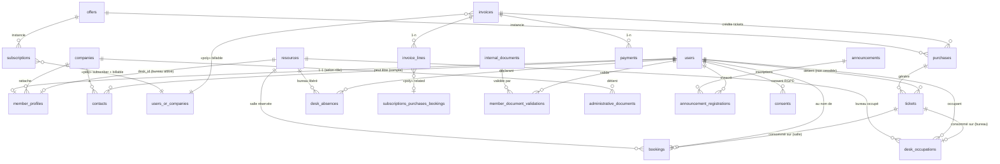

# data_model.md — Modèle de données Ecoworking

> Schéma détaillé de la base PostgreSQL 18. Source de vérité **technique** du schéma.
> Document dérivé de [`BRIEF.md`](./BRIEF.md) §7 et de [`PRD.md`](./PRD.md). En cas de divergence
> fonctionnelle, le PRD prime ; en cas de divergence d'infra, le BRIEF prime. Ce fichier traduit
> ces décisions en tables/colonnes/contraintes.
>
> **Conventions de marquage** (alignées sur le PRD) :
> - `🟡 **À valider**` : décision de modélisation prise par Claude, non explicitement figée dans les specs — à confirmer par Guillaume.
> - `❓ **Ouvert**` : point en attente d'une décision métier.
> - Le reste est figé (issu du PRD/BRIEF stabilisés au 2026-06-04).

---

## Sommaire

1. [Conventions de schéma](#1-conventions-de-schéma)
2. [Vue d'ensemble (diagramme)](#2-vue-densemble-diagramme)
3. [Énumérations](#3-énumérations)
4. [Tables — détail](#4-tables--détail)
   - 4.1 [Identité & accès](#41-identité--accès) (`users`, `member_profiles`, `companies`, `contacts`, `consents`)
   - 4.2 [Catalogue & contrats](#42-catalogue--contrats) (`offers`, `subscriptions`, `purchases`, `tickets`)
   - 4.3 [Ressources & occupation](#43-ressources--occupation) (`resources`, `bookings`, `desk_occupations`, `desk_absences`)
   - 4.4 [Facturation](#44-facturation) (`invoices`, `invoice_lines`, `payments`, `invoice_counters`)
   - 4.5 [Communication & documents](#45-communication--documents) (`announcements`, `announcement_registrations`, `internal_documents`, `member_document_validations`, `administrative_documents`)
   - 4.6 [Système](#46-système-laravel--paquets) (Laravel natif, Spatie, notifications)
5. [Relations polymorphes](#5-relations-polymorphes)
6. [Contraintes métier critiques](#6-contraintes-métier-critiques)
7. [RGPD — anonymisation & rétention](#7-rgpd--anonymisation--rétention)
8. [Facturation électronique (champs anticipés V2)](#8-facturation-électronique-champs-anticipés-v2)
9. [Points ouverts](#9-points-ouverts)

---

## 1. Conventions de schéma

| Sujet | Convention |
|---|---|
| **SGBD** | PostgreSQL 18 (cache, sessions, queues incluses — cf. ADR-0007) |
| **Clés primaires** | `id` `bigIncrements` (bigint auto-incrément) sauf tables système (uuid pour `notifications`) |
| **Nommage tables** | pluriel, `snake_case` (`member_profiles`) |
| **Nommage colonnes** | `snake_case` ; FK suffixées `_id` ; booléens préfixés `is_`/`has_`/`requires_` ou verbe d'opt-in (`show_in_directory`) |
| **Timestamps** | `created_at` / `updated_at` (`timestampsTz`) sur toutes les tables métier. Colonnes datées métier en `timestamptz` ; dates pures (échéance, naissance, jour d'absence) en `date` |
| **Argent** | `DECIMAL(10,2)` **uniquement** — jamais `float`/`double`. `vat_rate` en `DECIMAL(5,2)` (ex. `20.00`). Devise `EUR` implicite (MVP mono-devise) |
| **Énumérations** | stockées en `varchar` + **CHECK constraint** + cast `enum` PHP 8.5 côté modèle. Pas de type `ENUM` natif Postgres (migrations douloureuses). Indexées si filtrées (`status`, `type`) |
| **Soft delete** | `deleted_at` (`softDeletes`) sur entités sensibles **uniquement** : `users`, `companies`, `invoices`, `payments`, `internal_documents`, `administrative_documents`, `announcements` |
| **Foreign keys** | `onDelete` explicite partout (`restrict` par défaut sur données comptables, `cascade` sur enfants purs, `set null` sur liens optionnels) |
| **Index** | déclarés explicitement : toutes les FK, colonnes `status`/`type`, colonnes de filtrage fréquent (`date`, `starts_at`), uniques métier |
| **Polymorphisme** | colonnes `xxx_type` / `xxx_id`. **Morph map** obligatoire dans `AppServiceProvider` (alias courts `user`, `company`, `subscription`, `purchase`, `booking`) pour découpler la DB des namespaces PHP |
| **JSON** | colonnes `jsonb` (indexable) pour `features`, `data` de notifications, adresses snapshot |
| **Migrations** | toujours réversibles (`down()` propre), cf. CLAUDE.md §4.1 |

> 🟡 **À valider — Postgres comme seule dépendance** : `cache`, `sessions`, `jobs`, `job_batches`,
> `failed_jobs`, `cache_locks` vivent en base (driver `database`), conformément à ADR-0007 (pas de Redis en MVP).

---

## 2. Vue d'ensemble (diagramme)

Diagramme de domaine (relations principales — détail complet en §4 et §5). Les liens polymorphes
sont notés `«poly»`.



> `users_or_companies` et `subscriptions_purchases_bookings` ne sont **pas** des tables : ce sont des
> cibles polymorphes (cf. §5). Mermaid ne sait pas les rendre nativement.

---

## 3. Énumérations

Référence centrale des valeurs autorisées (CHECK + enum PHP).

| Enum (colonne) | Valeurs | Tables |
|---|---|---|
| **rôles** (Spatie, pas un enum de colonne) | `admin`, `resident`, `additional`, `external`, `staff`, `billing_contact` | `roles` |
| `member_profiles.status` | `active`, `paused`, `left` | `member_profiles` |
| `companies.entity_type` | `company`, `individual` | `companies` |
| `companies.status` | `active`, `inactive` | `companies` |
| `payment_method` | `sepa`, `transfer`, `card`, `check`, `cash` | `companies.preferred_payment_method`, `payments.method` |
| `contacts.role` | `billing`, `management`, `technical` | `contacts` |
| `offers.type` | `subscription`, `one_shot`, `pack` | `offers` |
| `offers.subscriber_kind` | `member`, `entity` | `offers` |
| `offers.billing_period` | `monthly`, `one_time` | `offers` |
| `ticket_type` | `desk_half_day`, `meeting_room_half_day` | `offers.ticket_type`, `purchases.ticket_type`, `tickets.type` |
| `subscriptions.status` | `active`, `paused`, `ended`, `cancelled` | `subscriptions` |
| `tickets.status` | `available`, `used`, `restituted`, `cancelled` | `tickets` — **pas** de `expired` (aucune expiration) |
| `resources.type` | `desk`, `meeting_room`, `event_room` | `resources` |
| `resources.assignment` | `assigned_resident`, `assigned_staff`, `unassigned` | `resources` (desk only, sinon NULL) |
| `period` | `morning`, `afternoon`, `full_day` | `desk_occupations.period`, `desk_absences.period` |
| `desk_occupations.source` | `resident_default`, `external_ticket` | `desk_occupations` |
| `desk_occupations.status` | `present`, `absent`, `cancelled` | `desk_occupations` |
| `desk_absences.recurrence_type` | `none`, `weekly` | `desk_absences` |
| `bookings.status` | `confirmed`, `cancelled`, `no_show` | `bookings` |
| `invoices.status` | `draft`, `sent`, `paid`, `partially_paid`, `overdue`, `cancelled` | `invoices` |
| `announcements.type` | `info`, `event`, `alert` | `announcements` |
| `audience` / `visibility` | `all`, `residents`, `additional`, `billing_contact` | `announcements.visibility`, `internal_documents.audience` |
| `announcements.status` | `draft`, `published`, `archived` | `announcements` |
| `announcement_registrations.status` | `registered`, `cancelled`, `attended`, `no_show` | `announcement_registrations` |
| `internal_documents.type` | `charter`, `cgu`, `image_rights`, `other` | `internal_documents` |
| `administrative_documents.type` | `contract`, `amendment`, `domiciliation`, `other` | `administrative_documents` |

---

## 4. Tables — détail

> Notation colonnes : `nom` `type` · `NULL?` · défaut · note. FK = clé étrangère avec `onDelete`.

### 4.1 Identité & accès

#### `users`
Authentification de **tous** les comptes (admins, membres, externes, contacts factu). Champs d'identité
+ auth + préférences transverses. Les données de **profil public** vivent dans `member_profiles` (§4.1).

| Colonne | Type | NULL | Défaut | Note |
|---|---|---|---|---|
| `id` | bigint PK | | | |
| `first_name` | varchar(100) | | | Lecture seule côté portail (édition admin) |
| `last_name` | varchar(100) | | | idem |
| `email` | varchar(255) | | | **UNIQUE** (login). Changement → confirmation par email |
| `email_verified_at` | timestamptz | ✓ | NULL | |
| `password` | varchar(255) | | | Argon2id (cf. BRIEF §8) |
| `two_factor_secret` | text | ✓ | NULL | Fortify 2FA (TOTP) |
| `two_factor_recovery_codes` | text | ✓ | NULL | chiffré |
| `two_factor_confirmed_at` | timestamptz | ✓ | NULL | |
| `calendar_token` | varchar(64) | ✓ | NULL | **UNIQUE**. Secret iCal révocable (flux perso + entité, PRD §3.5.8). Régénérable |
| `notify_email` | boolean | | `true` | Toggle notifications email (PRD §3.8.4) |
| `notify_in_app` | boolean | | `true` | Toggle notifications in-app |
| `theme` | varchar(10) | ✓ | NULL | `light`/`dark`/NULL(auto). Persistance admin ; le portail SPA persiste en localStorage 🟡 |
| `last_login_at` | timestamptz | ✓ | NULL | |
| `anonymized_at` | timestamptz | ✓ | NULL | Marqueur RGPD (cf. §7) |
| `remember_token` | varchar(100) | ✓ | NULL | |
| `created_at` / `updated_at` | timestamptz | | | |
| `deleted_at` | timestamptz | ✓ | NULL | **softDeletes** |

Index : `email` (unique), `calendar_token` (unique), `deleted_at`.

#### `member_profiles`
1-1 **optionnel** avec `users`. Existe pour les rôles à présence physique/membre : `resident`,
`additional`, `external`, `staff`. **N'existe pas** pour `billing_contact` pur ni `admin` sans cumul membre.
Porte le profil public (annuaire) + le rattachement entité + le bureau attitré.

| Colonne | Type | NULL | Défaut | Note |
|---|---|---|---|---|
| `id` | bigint PK | | | |
| `user_id` | bigint FK→users | | | **UNIQUE** (1-1). `onDelete restrict` (anonymiser, pas supprimer) |
| `company_id` | bigint FK→companies | ✓ | NULL | Entité juridique de rattachement. **NOT NULL au niveau app pour resident/additional/external** ; NULL pour `staff` (personnel Ecoworking, pas d'entité payante) 🟡. `onDelete restrict` |
| `desk_id` | bigint FK→resources | ✓ | NULL | Bureau attitré (resource `desk`). **UNIQUE** (un bureau ↔ un membre). `onDelete set null` |
| `status` | varchar(10) | | `active` | `active`/`paused`/`left` |
| `arrival_date` | date | ✓ | NULL | Date d'arrivée |
| `departure_date` | date | ✓ | NULL | Date de départ (si `left`) |
| `photo_path` | varchar(255) | ✓ | NULL | Cellar (3 tailles dérivées : 80/200/400, cf. PRD §3.4.2) |
| `birth_date` | date | ✓ | NULL | Optionnelle |
| `job_title` | varchar(150) | ✓ | NULL | Fonction/poste |
| `bio` | text | ✓ | NULL | Présentation markdown (≤ ~500 car. source) |
| `interests` | varchar(255) | ✓ | NULL | Centres d'intérêt |
| `linkedin_url` | varchar(255) | ✓ | NULL | |
| `website_url` | varchar(255) | ✓ | NULL | |
| `show_in_directory` | boolean | | `false` | Opt-in annuaire |
| `newsletter_opt_in` | boolean | | `false` | Opt-in newsletter |
| `admin_notes` | text | ✓ | NULL | Notes internes, non visibles portail |
| `created_at` / `updated_at` | timestamptz | | | |

Index : `user_id` (unique), `company_id`, `desk_id` (unique), `status`.

#### `companies`
**Entités billables** : entreprises (`company`, avec SIRET) **et** particuliers (`individual`, ex. `external`
personne physique). Porte aussi la **remise négociée** et le mandat SEPA.

| Colonne | Type | NULL | Défaut | Note |
|---|---|---|---|---|
| `id` | bigint PK | | | |
| `entity_type` | varchar(10) | | | `company`/`individual` — non modifiable après création (sauf override admin) |
| `status` | varchar(10) | | `active` | `active`/`inactive` |
| `legal_name` | varchar(255) | ✓ | NULL | Raison sociale — **requis si `company`** |
| `legal_form` | varchar(50) | ✓ | NULL | SARL, SAS, EI, association… |
| `siret` | varchar(14) | ✓ | NULL | **Requis si `company`** (FR). Validation 14 chiffres |
| `vat_number` | varchar(20) | ✓ | NULL | TVA intracom |
| `ape_code` | varchar(10) | ✓ | NULL | Optionnel |
| `first_name` | varchar(100) | ✓ | NULL | **Requis si `individual`** |
| `last_name` | varchar(100) | ✓ | NULL | **Requis si `individual`** |
| `birth_date` | date | ✓ | NULL | Particulier, cas spécifiques |
| `billing_email` | varchar(255) | ✓ | NULL | Email de facturation |
| `address_line1` | varchar(255) | ✓ | NULL | |
| `address_line2` | varchar(255) | ✓ | NULL | |
| `postal_code` | varchar(16) | ✓ | NULL | |
| `city` | varchar(120) | ✓ | NULL | |
| `country` | varchar(2) | | `FR` | ISO-3166-1 alpha-2 |
| `preferred_payment_method` | varchar(10) | ✓ | NULL | `sepa`/`transfer`/`card`/`check`/`cash` |
| `sepa_iban_last4` | varchar(4) | ✓ | NULL | **Jamais l'IBAN complet** (RGPD, CLAUDE.md §3.4) |
| `sepa_mandate_reference` | varchar(64) | ✓ | NULL | |
| `sepa_mandate_signed_at` | date | ✓ | NULL | |
| `sepa_mandate_path` | varchar(255) | ✓ | NULL | PDF chiffré sur Cellar |
| `discount_rate` | decimal(5,2) | ✓ | NULL | **Remise négociée** en % (unique mécanisme de remise, PRD §6.4) |
| `discount_scope` | varchar(40) | ✓ | NULL | Portée de la remise, ex. `resident_desk` (code d'offre) ou `all` 🟡 |
| `discount_note` | varchar(255) | ✓ | NULL | Justification (volume, promo temporaire…) |
| `admin_notes` | text | ✓ | NULL | |
| `created_at` / `updated_at` | timestamptz | | | |
| `deleted_at` | timestamptz | ✓ | NULL | **softDeletes** |

Index : `entity_type`, `status`, `siret`, `city`, `deleted_at`.

> 🟡 **Remise — extensibilité** : MVP = un seul couple `(discount_rate, discount_scope)` par entité (couvre
> l'exemple « −50 % sur bureaux résident »). Si plusieurs portées simultanées deviennent nécessaires,
> extraire dans une table `company_discounts (company_id, scope, rate, …)` en V2.

#### `contacts`
Personnes liées à une entité (facturation, management, technique). Peut référencer un compte portail.

| Colonne | Type | NULL | Défaut | Note |
|---|---|---|---|---|
| `id` | bigint PK | | | |
| `company_id` | bigint FK→companies | | | `onDelete cascade` |
| `user_id` | bigint FK→users | ✓ | NULL | Si le contact a un compte portail. `onDelete set null` |
| `first_name` | varchar(100) | | | |
| `last_name` | varchar(100) | | | |
| `email` | varchar(255) | ✓ | NULL | |
| `phone` | varchar(30) | ✓ | NULL | |
| `role` | varchar(20) | | | `billing`/`management`/`technical` |
| `is_primary` | boolean | | `false` | Contact principal |
| `notes` | text | ✓ | NULL | |
| `created_at` / `updated_at` | timestamptz | | | |

Index : `company_id`, `user_id`, `role`.

#### `consents`
Historique **append-only** des consentements RGPD (newsletter, annuaire, droit image, CGU…).

| Colonne | Type | NULL | Défaut | Note |
|---|---|---|---|---|
| `id` | bigint PK | | | |
| `user_id` | bigint FK→users | | | `onDelete cascade` (un consentement n'a pas de sens sans le user) |
| `type` | varchar(40) | | | `newsletter`/`directory`/`terms`/`image_rights`/… |
| `granted` | boolean | | | Accordé (true) ou retiré (false) |
| `granted_at` | timestamptz | ✓ | NULL | |
| `revoked_at` | timestamptz | ✓ | NULL | |
| `ip_address` | varchar(45) | ✓ | NULL | Preuve (IPv4/IPv6) |
| `source` | varchar(60) | ✓ | NULL | Origine (`portal_profile`, `signup`…) |
| `created_at` / `updated_at` | timestamptz | | | |

Index : `(user_id, type)`. On **ajoute** une ligne à chaque changement, on n'écrase jamais.

---

### 4.2 Catalogue & contrats

#### `offers`
Catalogue des prestations. Les **prix ne sont pas figés** chez l'abonné : ils sont relus depuis l'offre
courante à chaque facturation (cf. §6). Mis à jour ~1×/an, applicables à tous dès validation.

| Colonne | Type | NULL | Défaut | Note |
|---|---|---|---|---|
| `id` | bigint PK | | | |
| `code` | varchar(40) | | | **UNIQUE** (`resident_desk`, `additional_person`, `domiciliation`, `desk_half_day`, …) |
| `name` | varchar(150) | | | |
| `description` | text | ✓ | NULL | |
| `type` | varchar(20) | | | `subscription`/`one_shot`/`pack` |
| `subscriber_kind` | varchar(10) | | `member` | `member` (abos membre, tickets) / `entity` (domiciliation) |
| `billing_period` | varchar(10) | ✓ | NULL | `monthly` (abos) / `one_time` (tickets/packs) |
| `unit_price_ht` | decimal(10,2) | | | Prix HT courant |
| `vat_rate` | decimal(5,2) | | `20.00` | TVA FR 20 % |
| `quantity_per_purchase` | integer | | `1` | Pack 2 → 2, pack 10 → 10 |
| `ticket_type` | varchar(30) | ✓ | NULL | `desk_half_day`/`meeting_room_half_day` (offres tickets uniquement) |
| `max_per_user` | integer | ✓ | NULL | Plafond éventuel |
| `requires_active_resident` | boolean | | `false` | `additional_person` + `domiciliation` (éligibilité : ≥1 resident actif sur l'entité) |
| `features` | jsonb | ✓ | NULL | Caractéristiques libres |
| `is_active` | boolean | | `true` | Désactivée = plus proposée (abos existants continuent) |
| `is_public` | boolean | | `true` | Visible au catalogue |
| `display_order` | integer | | `0` | |
| `created_at` / `updated_at` | timestamptz | | | |

Index : `code` (unique), `type`, `is_active`, `ticket_type`.

**Données catalogue MVP** (tout HT, TVA 20 %) — cf. PRD §4.5.1 / §6.3 :

| `code` | `type` | `subscriber_kind` | `unit_price_ht` | `quantity_per_purchase` | `ticket_type` | `requires_active_resident` |
|---|---|---|---|---|---|---|
| `resident_desk` | subscription | member | 328.50 | 1 | — | false |
| `additional_person` | subscription | member | 59.00 | 1 | — | true |
| `domiciliation` | subscription | entity | 35.00 | 1 | — | true |
| `desk_half_day` | one_shot | member | 17.50 | 1 | desk_half_day | false |
| `desk_half_day_pack2` | pack | member | 31.50 | 2 | desk_half_day | false |
| `desk_half_day_pack10` | pack | member | 140.00 | 10 | desk_half_day | false |
| `meeting_room_half_day` | one_shot | member | 71.00 | 1 | meeting_room_half_day | false |
| `meeting_room_half_day_pack10` | pack | member | 568.00 | 10 | meeting_room_half_day | false |

> 🟡 **Packs = offres distinctes** (un SKU par prix vendable) plutôt qu'une table de paliers : plus simple,
> et le prix est de toute façon snapshoté sur le `purchase`. Le **créneau** matin/après-midi d'un ticket est
> choisi **à la réservation**, jamais au niveau de l'offre.

#### `subscriptions`
Abonnements récurrents — membres (`resident`, `additional`) **et** domiciliation d'entité.
**Souscripteur ET billable polymorphes** (User pour les abos membre ; Company pour la domiciliation).
**Aucun prix figé** ici (recalcul depuis le catalogue à chaque facturation).

| Colonne | Type | NULL | Défaut | Note |
|---|---|---|---|---|
| `id` | bigint PK | | | |
| `offer_id` | bigint FK→offers | | | `onDelete restrict` |
| `subscriber_type` | varchar(20) | | | morph : `user`/`company` |
| `subscriber_id` | bigint | | | morph (User = abo membre ; Company = domiciliation) |
| `billable_type` | varchar(20) | | | morph : `user`/`company` |
| `billable_id` | bigint | | | morph (entité ou user facturé) |
| `status` | varchar(12) | | `active` | `active`/`paused`/`ended`/`cancelled` |
| `starts_at` | date | | | Début |
| `ends_at` | date | ✓ | NULL | Fin prévue/effective |
| `billing_day` | smallint | | `1` | Jour de facturation mensuelle |
| `paused_at` | timestamptz | ✓ | NULL | |
| `cancel_reason` | varchar(255) | ✓ | NULL | |
| `notes` | text | ✓ | NULL | |
| `created_at` / `updated_at` | timestamptz | | | |

Index : `offer_id`, `(subscriber_type, subscriber_id)`, `(billable_type, billable_id)`, `status`.

#### `purchases`
Achats ponctuels (tickets/packs). **Crédités par l'admin** en MVP (via facture ou crédit manuel).
**Prix snapshoté** au moment de l'achat (contrairement aux subscriptions).

| Colonne | Type | NULL | Défaut | Note |
|---|---|---|---|---|
| `id` | bigint PK | | | |
| `offer_id` | bigint FK→offers | ✓ | NULL | SKU acheté (NULL si crédit manuel hors catalogue). `onDelete set null` |
| `user_id` | bigint FK→users | | | Bénéficiaire (détenteur des tickets). `onDelete restrict` |
| `billable_type` | varchar(20) | ✓ | NULL | morph `user`/`company` (entité facturée) |
| `billable_id` | bigint | ✓ | NULL | morph |
| `invoice_id` | bigint FK→invoices | ✓ | NULL | Facture d'origine (crédit auto). NULL si crédit manuel. `onDelete set null` |
| `ticket_type` | varchar(30) | | | `desk_half_day`/`meeting_room_half_day` |
| `quantity` | integer | | | Nb de tickets générés |
| `unit_price_ht` | decimal(10,2) | | `0` | **Snapshot** (0 si geste commercial) |
| `vat_rate` | decimal(5,2) | | `20.00` | **Snapshot** |
| `label` | varchar(255) | ✓ | NULL | |
| `purchased_at` | timestamptz | | | |
| `created_by` | bigint FK→users | ✓ | NULL | Admin créateur. `onDelete set null` |
| `created_at` / `updated_at` | timestamptz | | | |

Index : `offer_id`, `user_id`, `invoice_id`, `ticket_type`.

#### `tickets`
Tickets unitaires consommables. **Non cessibles** (rattachés au `user_id` détenteur, immuable).
**Aucune expiration**.

| Colonne | Type | NULL | Défaut | Note |
|---|---|---|---|---|
| `id` | bigint PK | | | |
| `purchase_id` | bigint FK→purchases | ✓ | NULL | Parent (NULL si crédit manuel direct). `onDelete set null` |
| `user_id` | bigint FK→users | | | Détenteur — **immuable** (non cessible). `onDelete restrict` |
| `type` | varchar(30) | | | `desk_half_day`/`meeting_room_half_day` |
| `status` | varchar(12) | | `available` | `available`/`used`/`restituted`/`cancelled` — **pas** d'`expired` |
| `consumed_at` | timestamptz | ✓ | NULL | Effacé si restitution (annulation dans le délai) |
| `booking_id` | bigint FK→bookings | ✓ | NULL | Si consommé sur une salle. `onDelete set null` |
| `desk_occupation_id` | bigint FK→desk_occupations | ✓ | NULL | Si consommé sur un bureau. `onDelete set null` |
| `credited_by` | bigint FK→users | ✓ | NULL | Admin si crédit manuel. `onDelete set null` |
| `credit_reason` | varchar(255) | ✓ | NULL | |
| `created_at` / `updated_at` | timestamptz | | | |

Index : `purchase_id`, `user_id`, `type`, `status`, `(user_id, type, status)` (compteurs « Mes tickets »).

---

### 4.3 Ressources & occupation

#### `resources`
Bureaux (48) + salles de réunion (3) + salle event (1). Champs adaptés au `type`.

| Colonne | Type | NULL | Défaut | Note |
|---|---|---|---|---|
| `id` | bigint PK | | | |
| `type` | varchar(15) | | | `desk`/`meeting_room`/`event_room` |
| `name` | varchar(120) | | | |
| `description` | text | ✓ | NULL | |
| `capacity` | integer | ✓ | NULL | Salles |
| `features` | jsonb | ✓ | NULL | TV, whiteboard, écran… |
| `assignment` | varchar(20) | ✓ | NULL | **desk only** : `assigned_resident`/`assigned_staff`/`unassigned` ; NULL sinon |
| `floor` | smallint | ✓ | NULL | Étage 1/2 (desks) |
| `svg_desk_id` | varchar(40) | ✓ | NULL | **UNIQUE**. Mapping `data-desk-id` du plan SVG (desks) |
| `external_half_day_price_ht` | decimal(10,2) | ✓ | NULL | Tarif demi-journée external (meeting_room) — référence ; le prix réel reste l'offre ticket |
| `opening_hours` | jsonb | ✓ | NULL | Plages d'ouverture. Défaut : 24/24 resident, 9h-18h ouvré external (logique applicative) |
| `requires_admin` | boolean | | `false` | `true` pour `event_room` (réservable admin only) |
| `google_calendar_color` | varchar(20) | ✓ | NULL | Couleur sync Google |
| `is_active` | boolean | | `true` | |
| `is_out_of_service` | boolean | | `false` | Bureau hors service (maintenance) |
| `display_order` | integer | | `0` | |
| `created_at` / `updated_at` | timestamptz | | | |

Index : `type`, `assignment`, `floor`, `svg_desk_id` (unique), `is_active`.

#### `bookings`
Réservations de **salles** (`meeting_room` + `event_room`). **Pas** les bureaux (→ `desk_occupations`).

| Colonne | Type | NULL | Défaut | Note |
|---|---|---|---|---|
| `id` | bigint PK | | | |
| `resource_id` | bigint FK→resources | | | `onDelete restrict` |
| `user_id` | bigint FK→users | ✓ | NULL | « Au nom de ». NULL pour blocage interne sans personne. `onDelete restrict` |
| `billable_type` | varchar(20) | ✓ | NULL | morph `user`/`company`. NULL si interne/gratuit |
| `billable_id` | bigint | ✓ | NULL | morph |
| `title` | varchar(255) | ✓ | NULL | Libellé/info |
| `starts_at` | timestamptz | | | |
| `ends_at` | timestamptz | | | CHECK `ends_at > starts_at` |
| `status` | varchar(12) | | `confirmed` | `confirmed`/`cancelled`/`no_show` |
| `price_ht` | decimal(10,2) | ✓ | NULL | Snapshot (external payant) ; NULL si gratuit (resident/additional/staff/interne) |
| `vat_rate` | decimal(5,2) | ✓ | NULL | Snapshot si payant |
| `ticket_id` | bigint FK→tickets | ✓ | NULL | Ticket consommé (external). `onDelete set null` |
| `is_internal` | boolean | | `false` | Blocage interne Ecoworking (prix 0, pas de notif) |
| `recurrence_group_id` | uuid | ✓ | NULL | Regroupe une série créée par l'admin |
| `cancel_reason` | varchar(255) | ✓ | NULL | |
| `cancelled_at` | timestamptz | ✓ | NULL | |
| `google_calendar_event_id` | varchar(255) | ✓ | NULL | Matching sync sortante |
| `created_by` | bigint FK→users | ✓ | NULL | Créateur (membre ou admin). `onDelete set null` |
| `created_at` / `updated_at` | timestamptz | | | |

Index : `resource_id`, `user_id`, `status`, `(resource_id, starts_at, ends_at)` (détection de conflit),
`(billable_type, billable_id)`, `recurrence_group_id`.

> **Anti-double-booking** (décidé : (A) + (D)) : verrou applicatif `lockForUpdate()` sur les résa
> chevauchantes (PRD §5.4) **+ backstop DB** — contrainte d'exclusion GiST `EXCLUDE USING gist
> (resource_id WITH =, tstzrange(starts_at, ends_at) WITH &&) WHERE (status = 'confirmed')`
> (extension `btree_gist` requise).

#### `desk_occupations`
Occupation effective d'un bureau, par demi-journée. **Stocke principalement les occupations `external_ticket`** ;
la présence par défaut des résidents/staff est **dérivée** (assignment − absences), donc rarement matérialisée
(évite des milliers de lignes). La valeur `resident_default` reste possible pour un enregistrement explicite admin.

| Colonne | Type | NULL | Défaut | Note |
|---|---|---|---|---|
| `id` | bigint PK | | | |
| `desk_id` | bigint FK→resources | | | `onDelete restrict` |
| `user_id` | bigint FK→users | | | Occupant. `onDelete restrict` |
| `date` | date | | | |
| `period` | varchar(10) | | | `morning`/`afternoon`/`full_day` |
| `source` | varchar(20) | | | `resident_default`/`external_ticket` |
| `ticket_id` | bigint FK→tickets | ✓ | NULL | Si `external_ticket`. `onDelete set null` |
| `status` | varchar(10) | | `present` | `present`/`absent`/`cancelled` |
| `created_by` | bigint FK→users | ✓ | NULL | Admin si déclaré. `onDelete set null` |
| `created_at` / `updated_at` | timestamptz | | | |

Index : `desk_id`, `user_id`, `date`, `(date, source, status)` (calcul de dispo external), `(desk_id, date, period)`.

> Disponibilité external = `COUNT(resources desk unassigned active) − COUNT(desk_occupations date=J,
> source=external_ticket, status=present)` (PRD §6.1). La source `additional_borrowing` est **abandonnée**.

#### `desk_absences`
Déclarations d'absence d'un résident/staff sur **son** bureau attitré. Expansion des récurrences **à la lecture**
(jamais de pré-génération de N lignes).

| Colonne | Type | NULL | Défaut | Note |
|---|---|---|---|---|
| `id` | bigint PK | | | |
| `desk_id` | bigint FK→resources | | | `onDelete cascade` |
| `user_id` | bigint FK→users | | | Déclarant. `onDelete cascade` |
| `date_start` | date | | | |
| `date_end` | date | ✓ | NULL | NULL = jour unique |
| `period` | varchar(10) | | `full_day` | `morning`/`afternoon`/`full_day` |
| `recurrence_type` | varchar(10) | | `none` | `none`/`weekly` |
| `recurrence_day_of_week` | smallint | ✓ | NULL | 0=dim … 6=sam (si `weekly`) |
| `notes` | varchar(255) | ✓ | NULL | Visible admin only |
| `created_by` | bigint FK→users | ✓ | NULL | Admin si posé pour le membre. `onDelete set null` |
| `created_at` / `updated_at` | timestamptz | | | |

Index : `desk_id`, `user_id`, `date_start`, `recurrence_type`.

> Notification admin **systématique** à chaque absence enregistrée (Q25 résolue).

---

### 4.4 Facturation

#### `invoices`
Factures. **Émise = jamais supprimée** (CGI art. 289). Seuls les `draft` sont supprimables. Annulation =
passage `cancelled` + **avoir** auto (V2). Montants figés sur les lignes à l'émission. Snapshot adresse facturation.

| Colonne | Type | NULL | Défaut | Note |
|---|---|---|---|---|
| `id` | bigint PK | | | |
| `number` | varchar(20) | ✓ | NULL | `EW-YYYY-NNNNN`. **NULL tant que `draft`** (le compteur n'est consommé qu'à l'émission). **UNIQUE** |
| `billable_type` | varchar(20) | | | morph `user`/`company` |
| `billable_id` | bigint | | | morph |
| `status` | varchar(16) | | `draft` | `draft`/`sent`/`paid`/`partially_paid`/`overdue`/`cancelled` |
| `issued_at` | date | ✓ | NULL | Date d'émission (NULL si draft) |
| `due_at` | date | ✓ | NULL | `issued_at + 14 jours` |
| `billing_name` | varchar(255) | ✓ | NULL | **Snapshot** à l'émission (raison sociale ou nom particulier) |
| `billing_address` | jsonb | ✓ | NULL | **Snapshot** adresse complète |
| `billing_siret` | varchar(14) | ✓ | NULL | Snapshot (si `company`) |
| `billing_vat_number` | varchar(20) | ✓ | NULL | Snapshot |
| `subtotal_ht` | decimal(10,2) | | `0` | Σ lignes HT |
| `total_vat` | decimal(10,2) | | `0` | Σ TVA |
| `total_ttc` | decimal(10,2) | | `0` | TTC |
| `amount_paid` | decimal(10,2) | | `0` | Σ paiements (dû = `total_ttc − amount_paid`) |
| `pdf_path` | varchar(255) | ✓ | NULL | Cellar `invoices/YYYY/EW-YYYY-NNNNN.pdf` |
| `notes` | text | ✓ | NULL | Notes admin (éditable même après émission) |
| `is_credit_note` | boolean | | `false` | `true` si cette ligne est un avoir |
| `credit_note_for_invoice_id` | bigint FK→invoices | ✓ | NULL | (avoir) facture annulée d'origine. `onDelete restrict` |
| `cancellation_credit_note_id` | bigint FK→invoices | ✓ | NULL | (facture annulée) son avoir. `onDelete restrict` |
| `cancelled_at` | timestamptz | ✓ | NULL | |
| `factur_x_xml_path` | varchar(255) | ✓ | NULL | **V2** (cf. §8) |
| `pa_transmission_id` | varchar(120) | ✓ | NULL | **V2** Plateforme Agréée |
| `pa_transmission_status` | varchar(40) | ✓ | NULL | **V2** |
| `emitted_by` | bigint FK→users | ✓ | NULL | Admin émetteur. `onDelete set null` |
| `created_at` / `updated_at` | timestamptz | | | |
| `deleted_at` | timestamptz | ✓ | NULL | **softDeletes** — n'autorise QUE les `draft` (cf. policy §6) |

Index : `number` (unique), `(billable_type, billable_id)`, `status`, `issued_at`, `due_at`, `deleted_at`.

#### `invoice_lines`
Lignes figées à l'émission. `related` polymorphe (origine de la ligne).

| Colonne | Type | NULL | Défaut | Note |
|---|---|---|---|---|
| `id` | bigint PK | | | |
| `invoice_id` | bigint FK→invoices | | | `onDelete cascade` (lignes ⊂ facture) |
| `related_type` | varchar(20) | ✓ | NULL | morph `subscription`/`purchase`/`booking`/NULL |
| `related_id` | bigint | ✓ | NULL | morph |
| `description` | varchar(255) | | | Libellé figé |
| `quantity` | decimal(10,2) | | `1` | |
| `unit_price_ht` | decimal(10,2) | | | **Figé à l'émission** |
| `discount_rate` | decimal(5,2) | ✓ | NULL | Snapshot de la remise entité appliquée |
| `vat_rate` | decimal(5,2) | | `20.00` | Figé |
| `line_total_ht` | decimal(10,2) | | | Figé (après remise) |
| `line_vat` | decimal(10,2) | | | Figé |
| `line_total_ttc` | decimal(10,2) | | | Figé |
| `period_start` | date | ✓ | NULL | Période couverte (abo/prorata) |
| `period_end` | date | ✓ | NULL | |
| `created_at` / `updated_at` | timestamptz | | | |

Index : `invoice_id`, `(related_type, related_id)`.

#### `payments`
Encaissements (statuts **manuels** — pas de paiement en ligne MVP).

| Colonne | Type | NULL | Défaut | Note |
|---|---|---|---|---|
| `id` | bigint PK | | | |
| `invoice_id` | bigint FK→invoices | | | `onDelete restrict` (intégrité comptable) |
| `amount` | decimal(10,2) | | | |
| `paid_at` | date | | | |
| `method` | varchar(10) | | | `sepa`/`transfer`/`card`/`check`/`cash` |
| `reference` | varchar(120) | ✓ | NULL | |
| `notes` | text | ✓ | NULL | |
| `created_by` | bigint FK→users | ✓ | NULL | `onDelete set null` |
| `created_at` / `updated_at` | timestamptz | | | |
| `deleted_at` | timestamptz | ✓ | NULL | **softDeletes** (correction tracée) |

Index : `invoice_id`, `method`, `paid_at`, `deleted_at`.

#### `invoice_counters`
Compteur de numérotation chronologique sans trou, verrouillé en transaction (`SELECT … FOR UPDATE`).

| Colonne | Type | NULL | Défaut | Note |
|---|---|---|---|---|
| `id` | bigint PK | | | |
| `year` | smallint | | | **UNIQUE** |
| `value` | integer | | `0` | Dernier numéro émis pour l'année |
| `created_at` / `updated_at` | timestamptz | | | |

> `InvoiceNumberingService::nextNumber()` : `firstOrCreate(['year'=>Y])->lockForUpdate()`, `increment('value')`,
> format `EW-Y-%05d` (cf. CLAUDE.md §6.2). **Aucun brouillon ne consomme le compteur.**

---

### 4.5 Communication & documents

#### `announcements`
Annonces (info / event / alert), avec inscription optionnelle aux events.

| Colonne | Type | NULL | Défaut | Note |
|---|---|---|---|---|
| `id` | bigint PK | | | |
| `type` | varchar(10) | | | `info`/`event`/`alert` |
| `title` | varchar(255) | | | |
| `body` | text | | | Markdown |
| `cover_image_path` | varchar(255) | ✓ | NULL | Cellar |
| `event_starts_at` | timestamptz | ✓ | NULL | Si event |
| `event_ends_at` | timestamptz | ✓ | NULL | |
| `location` | varchar(255) | ✓ | NULL | |
| `max_participants` | integer | ✓ | NULL | |
| `requires_registration` | boolean | | `false` | |
| `visibility` | varchar(16) | | `all` | `all`/`residents`/`additional`/`billing_contact` |
| `status` | varchar(12) | | `draft` | `draft`/`published`/`archived` |
| `published_at` | timestamptz | ✓ | NULL | |
| `created_by` | bigint FK→users | ✓ | NULL | `onDelete set null` |
| `created_at` / `updated_at` | timestamptz | | | |
| `deleted_at` | timestamptz | ✓ | NULL | **softDeletes** |

Index : `type`, `status`, `published_at`, `event_starts_at`.

#### `announcement_registrations`

| Colonne | Type | NULL | Défaut | Note |
|---|---|---|---|---|
| `id` | bigint PK | | | |
| `announcement_id` | bigint FK→announcements | | | `onDelete cascade` |
| `user_id` | bigint FK→users | | | `onDelete cascade` |
| `status` | varchar(12) | | `registered` | `registered`/`cancelled`/`attended`/`no_show` |
| `registered_at` | timestamptz | | | |
| `created_at` / `updated_at` | timestamptz | | | |

Index : `(announcement_id, user_id)` **UNIQUE**, `user_id`.

#### `internal_documents`
Documents communs versionnés (charte, CGU, droit image). Changement de version → re-validation requise.

| Colonne | Type | NULL | Défaut | Note |
|---|---|---|---|---|
| `id` | bigint PK | | | |
| `type` | varchar(16) | | | `charter`/`cgu`/`image_rights`/`other` |
| `title` | varchar(255) | | | |
| `version` | varchar(20) | | | Ex. `v1.0` (string libre) |
| `body` | text | ✓ | NULL | Markdown **ou** `pdf_path` |
| `pdf_path` | varchar(255) | ✓ | NULL | Cellar |
| `audience` | varchar(16) | | `all` | `all`/`residents`/`additional`/`billing_contact` |
| `published_at` | timestamptz | ✓ | NULL | |
| `is_active` | boolean | | `true` | |
| `created_by` | bigint FK→users | ✓ | NULL | `onDelete set null` |
| `created_at` / `updated_at` | timestamptz | | | |
| `deleted_at` | timestamptz | ✓ | NULL | **softDeletes** (preuve des versions) |

Index : `type`, `is_active`.

#### `member_document_validations`
**Append-only** : une ligne par validation (qui / quand / version validée). Nouvelle version → nouvelle ligne,
jamais d'écrasement.

| Colonne | Type | NULL | Défaut | Note |
|---|---|---|---|---|
| `id` | bigint PK | | | |
| `internal_document_id` | bigint FK→internal_documents | | | `onDelete cascade` |
| `user_id` | bigint FK→users | | | `onDelete cascade` |
| `version` | varchar(20) | | | **Snapshot** de la version validée |
| `validated_at` | timestamptz | | | |
| `ip_address` | varchar(45) | ✓ | NULL | Preuve |
| `created_at` / `updated_at` | timestamptz | | | |

Index : `(user_id, internal_document_id)`, `internal_document_id`.

#### `administrative_documents`
Documents propres à une entité (contrats, avenants, **contrat de domiciliation**).

| Colonne | Type | NULL | Défaut | Note |
|---|---|---|---|---|
| `id` | bigint PK | | | |
| `company_id` | bigint FK→companies | | | `onDelete restrict` |
| `type` | varchar(16) | | | `contract`/`amendment`/`domiciliation`/`other` |
| `title` | varchar(255) | | | |
| `pdf_path` | varchar(255) | | | Cellar |
| `document_date` | date | ✓ | NULL | |
| `uploaded_by` | bigint FK→users | ✓ | NULL | `onDelete set null` |
| `created_at` / `updated_at` | timestamptz | | | |
| `deleted_at` | timestamptz | ✓ | NULL | **softDeletes** (rétention 10 ans) |

Index : `company_id`, `type`.

---

### 4.6 Système (Laravel & paquets)

Tables non métier, fournies par le framework / les paquets — **ne pas réécrire** leurs migrations
(publiées par les paquets), juste les exécuter.

| Table | Origine | Note |
|---|---|---|
| `notifications` | Laravel (driver `database`) | id `uuid`, `type`, `notifiable_type/id`, `data` jsonb, `read_at`. Centre de notifs persistant (PRD §3.8.4) |
| `sessions` | Laravel | Driver `database` (ADR-0007) |
| `cache`, `cache_locks` | Laravel | Driver `database` |
| `jobs`, `job_batches`, `failed_jobs` | Laravel | Queue `database` |
| `password_reset_tokens` | Laravel/Fortify | Reset + magic link |
| `personal_access_tokens` | Sanctum | (SPA en mode cookie ; table présente par défaut) |
| `migrations` | Laravel | |
| `roles`, `permissions`, `model_has_roles`, `model_has_permissions`, `role_has_permissions` | `spatie/laravel-permission` | Rôles : `admin`, `resident`, `additional`, `external`, `staff`, `billing_contact` |
| `activity_log` | `spatie/laravel-activitylog` | Audit log auto (User, Company, Invoice, Subscription, Booking, Payment…) |
| `settings` | `spatie/laravel-settings` | Settings typés (préfixe factures, mentions, credentials…) |

> **Audit log** : activer le trait `LogsActivity` sur les modèles sensibles listés en CLAUDE.md §3.4.
> **PII redaction** : ne jamais logger d'IBAN complet, mot de passe, secret 2FA.

---

## 5. Relations polymorphes

Morph map (alias → modèle) à déclarer dans `AppServiceProvider::boot()` via `Relation::enforceMorphMap([...])` :

```
'user'         => App\Models\User::class,
'company'      => App\Models\Company::class,
'subscription' => App\Models\Subscription::class,
'purchase'     => App\Models\Purchase::class,
'booking'      => App\Models\Booking::class,
```

| Relation polymorphe | Colonnes | Cibles | Sens |
|---|---|---|---|
| `subscriptions.subscriber` | `subscriber_type/id` | `user` \| `company` | User = abo membre ; **Company = domiciliation** |
| `subscriptions.billable` | `billable_type/id` | `user` \| `company` | Entité/user facturé |
| `purchases.billable` | `billable_type/id` | `user` \| `company` | Entité/user facturé |
| `bookings.billable` | `billable_type/id` | `user` \| `company` | NULL si interne/gratuit |
| `invoices.billable` | `billable_type/id` | `user` \| `company` | Cible de la facture |
| `invoice_lines.related` | `related_type/id` | `subscription` \| `purchase` \| `booking` \| NULL | Origine de la ligne |

> **Toujours** scoper les accès polymorphes par Policy (CLAUDE.md §3.1). Un `billable` doit être résolu via
> la relation Eloquent, jamais par requête brute sur `auth()->id()`.

---

## 6. Contraintes métier critiques

> Implémentées par couches : **(U)** UI Filament/SPA, **(A)** application (Form Request / Service / Rule),
> **(D)** base (CHECK/UNIQUE/trigger). Le cœur sécurité passe par **(A) + Policy** ; **(D)** est un backstop.

1. **XOR rôle d'usage** — un user a **au plus un** de `resident`/`additional`/`external`/`staff`. (U) sélecteur unique ; (A) `Rule` custom dans le Form Request. **Niveau (A) seul** (décidé) : pas de trigger DB (risque faible — seul l'admin attribue les rôles, pas de concurrence — et trigger intrusif sur la table Spatie).
2. **Un seul `subscription` membre actif** par user (`status=active`, `subscriber_type=user`). La **domiciliation** (`subscriber_type=company`) est **hors** de cette règle. (A) validation à la création + index partiel possible.
3. **Domiciliation unique par entité** — une seule `subscription` `domiciliation` `active` par `company`. **(A) + (D)** (décidé) : check applicatif **et** index partiel unique DB `(subscriber_id) WHERE subscriber_type='company' AND offer=domiciliation AND status='active'` (filet anti-doublon en cas d'activations concurrentes).
4. **Éligibilité `requires_active_resident`** — `additional_person` et `domiciliation` activables **seulement** si l'entité a ≥1 `resident` actif. (A) check à l'activation.
5. **Numérotation factures** — chronologique sans trou via `invoice_counters` + `lockForUpdate` ; `number` posé **uniquement à l'émission**. (A) `InvoiceNumberingService` ; (D) `number` UNIQUE.
6. **Facture émise non supprimable** — `InvoicePolicy::delete()` ⇒ `false` dès que `status ≠ draft`. Pas de hard delete sur facture émise ; annulation = `cancelled` + avoir. (A) Policy + (D) pas de cascade destructive.
7. **Montants figés à l'émission** — `invoice_lines.*` figés ; **jamais** recalculés. Les abos n'ont **pas** de prix figé (relus du catalogue) — seules les factures figent. (A).
8. **Anti-double-booking** — deux résa `confirmed` ne se chevauchent pas sur la même salle. **(A) + (D)** (décidé) : `lockForUpdate` sur résa chevauchantes + 409 Conflict **et** contrainte d'exclusion GiST DB (filet de sécurité, cf. `bookings`).
9. **Ticket non cessible / sans expiration** — `tickets.user_id` immuable ; pas de statut `expired`. Restitution = `available` + `consumed_at` NULL. (A).
10. **Bureau ↔ membre 1-1** — `member_profiles.desk_id` **UNIQUE** ; cohérent avec `resources.assignment`. (D) unique + (A).
11. **`member_document_validations` append-only** — insertion uniquement, jamais update/delete. (A).
12. **Prorata** — `montant × (jours_consommés / jours_du_mois)`, **bornes incluses** (début **et** fin), `ROUND_HALF_UP` 2 décimales, TVA 20 % sur le proratisé (PRD §5.1). (A) Service.
13. **Idempotence facturation** — toute génération (cron/instant T/manuelle) vérifie l'absence de facture pour (cible, période) avant création. (A).
14. **Échéance** — `due_at = issued_at + 14 jours`, uniforme. (A).
15. **`calendar_token` unique & révocable** — régénération invalide l'ancien lien iCal. (D) UNIQUE + (A).
16. **Argent** — toutes les colonnes monétaires en `DECIMAL`, calculs HT/TVA/TTC **côté back** exclusivement. (A).

---

## 7. RGPD — anonymisation & rétention

**Workflow d'anonymisation** (PRD §5.6) — conserve l'intégrité comptable, efface le perso :

| Donnée | Action |
|---|---|
| `users.email` | → hash déterministe `deleted-<hash>@ecoworking.invalid` |
| `users.first_name` / `last_name` | → `"Utilisateur"` |
| `users.two_factor_*` | → NULL |
| `users.anonymized_at` | → `now()` ; puis **softDelete** (reconnexion impossible) |
| `member_profiles.bio` / `interests` / `linkedin_url` / `website_url` / `job_title` | → NULL |
| `member_profiles.birth_date` | → NULL |
| `member_profiles.photo_path` | → fichier supprimé de Cellar + NULL |
| **Conservé** (obligation légale) | `invoices`, `invoice_lines`, `payments` (billable pointant sur le user anonymisé), `activity_log` |

**Rétention** :
- Factures & pièces comptables : **10 ans** (`administrative_documents`, `invoices` soft-deleted jamais purgées sur cette fenêtre).
- `notifications` : historique configurable (~90 jours).
- IBAN : **jamais en clair** — uniquement `sepa_iban_last4` + mandat PDF chiffré (Cellar).
- Logs applicatifs : **pas de PII** (redaction).

---

## 8. Facturation électronique (champs anticipés V2)

Réforme 2026-2027 (BRIEF §9). Champs **présents dès le MVP** (nullables) pour éviter une migration lourde plus tard :

- `invoices.factur_x_xml_path` — chemin du XML CII embarqué (PDF/A-3).
- `invoices.pa_transmission_id` / `pa_transmission_status` — suivi de transmission via Plateforme Agréée.
- `companies.siret` (requis clients FR `company`) / `companies.vat_number` (si TVA intracom) — déjà au schéma.

Génération PDF MVP : `barryvdh/laravel-dompdf` (Q7.4-3). V2 Factur-X : `atgp/factur-x` (PDF/A-3 + XML CII).
Règles BtoC (`individual`) vs BtoB : **❓ ouvert (Q26)**, reporté avec l'expert-comptable — non bloquant MVP.

---

## 9. Points ouverts

Décisions de modélisation à confirmer (🟡) ou en attente métier (❓) :

1. 🟡 **`member_profiles.company_id` nullable pour `staff`** — assouplit la règle « company_id jamais NULL » (qui reste vraie pour resident/additional/external). Alternative : créer une entité `company` « Ecoworking » à laquelle rattacher le staff. *Recommandation : NULL pour staff (pas d'entité payante).*
2. 🟡 **Profil public sur `member_profiles`** (vs `users`) — cohérent avec l'anonymisation §5.6. Conséquence : un `billing_contact` pur (sans `member_profile`) n'édite que ses champs `users` (email/mdp/prefs notif), pas de bio/photo — conforme à la matrice §2.5.
3. 🟡 **Packs de tickets = offres distinctes** (SKU par prix) plutôt qu'une table de paliers de prix.
4. 🟡 **Remise entité = couple unique `(rate, scope)`** — extraire en table `company_discounts` si multi-portées en V2.
5. 🟡 **`desk_occupations.resident_default` rarement matérialisé** — présence résident/staff dérivée (assignment − absences). Confirmer qu'aucun besoin de matérialiser ces lignes en MVP.
6. ✅ **Contraintes backstop DB tranchées** (2026-06-04) : XOR rôles = **(A) seul** (pas de trigger) ; domiciliation unique = **(A) + (D)** (index partiel unique) ; anti-double-booking = **(A) + (D)** (exclusion GiST). Cf. §6 items 1, 3, 8.
7. ❓ **Q26 — Facturation BtoC vs BtoB** (Factur-X, assujettissement TVA `individual`) — expert-comptable, V2.

---

*Document dérivé du PRD/BRIEF stabilisés au 2026-06-04. À versionner à chaque évolution de schéma.
Prochaine étape logique : revue de ce modèle par Guillaume, puis scaffold des migrations (sur go explicite).*
